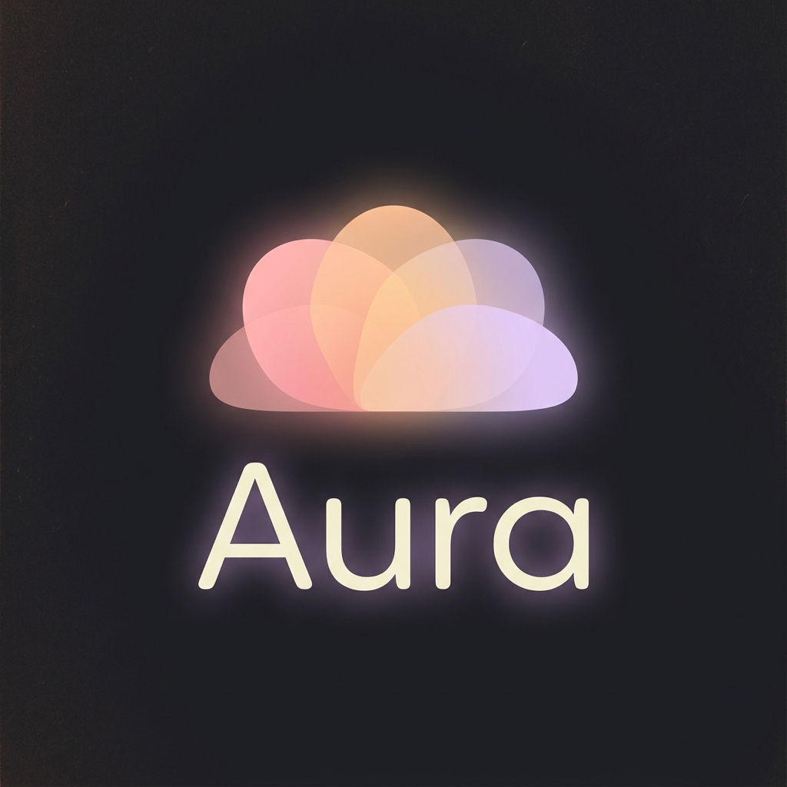

# 💖 Aura

<div align="center">



*Aura 像晨光初透时的微晕，像老唱片转动时的温润声场，也像你疲惫归家、推开门那一瞬心里悄悄亮起的光。*
*它不喧哗，却存在；不强制，却陪伴；不占有，却始终环绕着你。*

---

### 客户端


### 服务端


### AI


### 数据库


</div>

---

## 📖 简介

**Aura** 是一个 AI 陪伴聊天项目，采用前后端分层与多服务协作架构，覆盖 AI 对话、用户认证、管理后台、PC Web、Next.js Web、移动端和 BFF 聚合层。项目横跨 Java、Python、Node.js、Vue、React 与 React Native 多个技术方向。

---

## ✨ 功能介绍

### 🤖 AI 对话
- 基于 LangGraph 的多轮对话编排，支持工具调用与对话状态管理
- 通过 Server-Sent Events（SSE）返回流式响应
- 使用 Ollama/Qwen 作为本地对话模型，并预留记忆提取小模型
- 长期记忆通过 pgvector 进行语义检索，按用户隔离存储
- 天气查询、记忆保存、记忆搜索等工具已接入 Agent 流程

### 🗂️ 管理后台（Admin）
- Vue3 + Element Plus 管理后台基础界面
- 登录、注册、用户信息页面与 Pinia 状态管理
- 面向后续用户、会话、消息和配置管理扩展

### 🖥️ Web / PC 客户端
- `apps/PC`：Vue3 PC 聊天端，包含登录、注册、聊天、记忆、设置等页面
- `apps/web`：Next.js 16 + React 19 的新版 Aura 工作台，包含聊天、登录、记忆和设置界面
- 支持主题切换、路由过渡、请求封装和基础 UI 组件

### 📱 移动端
- React Native CLI 移动端工程已搭建
- Android / iOS 原生工程与 Metro 基础配置保留
- 默认模板屏幕已删除，目前只保留可启动空骨架
- 聊天界面、认证和后端联动仍在接入中

### 🧩 BFF 聚合层
- NestJS BFF 工程已搭建，并已删除默认模板 Controller / Service
- 计划承接鉴权、请求聚合、响应裁剪和 SSE 代理

---

## 🏗️ 技术架构

```
┌────────────────────────────────────────────────────────┐
│                      客户端层                           │
│  Admin(Vue3)  PC(Vue3)  Web(Next/React)  Mobile(RN)     │
└──────────────────────────┬─────────────────────────────┘
                           │ HTTP / SSE
┌──────────────────────────▼─────────────────────────────┐
│                    NestJS BFF 层                         │
│            请求聚合 · 鉴权承接 · 响应裁剪 · SSE 代理       │
└───────────────┬───────────────────────────┬────────────┘
                │                           │
┌───────────────▼──────────────┐ ┌──────────▼─────────────┐
│        Spring Boot            │ │        FastAPI          │
│   用户认证 / 用户资料 / JWT    │ │   AI 对话 / 记忆 / 工具  │
│   Redis 会话令牌 / MyBatis     │ │   LangGraph 编排 / SSE   │
└───────────────┬──────────────┘ └──────────┬─────────────┘
                │                           │
┌───────────────▼──────────────┐ ┌──────────▼─────────────┐
│       PostgreSQL + Redis      │ │   PostgreSQL + pgvector │
│       用户数据 / 令牌缓存      │ │   对话检查点 / 记忆向量   │
└──────────────────────────────┘ └────────────────────────┘
```

---

## 📁 仓库结构

```
AI-Web/                       # 前端 Monorepo（pnpm workspace）
├── apps/
│   ├── admin/                # Vue3 管理后台
│   ├── PC/                   # Vue3 PC 聊天端
│   ├── web/                  # Next.js + React 新版 Web 工作台
│   ├── mobile/               # React Native 移动端
│   └── ...
└── package/
    ├── Types/                # 共享 TypeScript 类型包
    └── ...

Server/                       # 后端服务
├── core-service/             # Spring Boot 用户认证与业务服务
├── ai-service/               # FastAPI + LangGraph AI 服务
└── ...
```

---

## 🚀 快速开始

### 环境要求
- Node.js 18+，移动端建议 Node.js 22.11+
- pnpm 10+
- Java 17+
- Python 3.12+ 与 uv
- PostgreSQL 16+
- Redis 7+
- Ollama，并准备 `qwen3:8b`、`qwen3:0.6b`、`nomic-embed-text:latest`

### 启动 AI 服务
```bash
cd Server/ai-service
uv sync
uv run uvicorn main:app --reload --host 127.0.0.1 --port 8000
```

### 启动核心后端服务
```bash
cd Server/core-service
./mvnw spring-boot:run
```

Windows PowerShell：
```powershell
cd Server/core-service
.\mvnw.cmd spring-boot:run
```

### 启动前端工作区
```bash
cd AI-Web
pnpm install
pnpm dev:admin              # Vue3 管理后台
pnpm --filter @ai-web/pc dev # Vue3 PC 聊天端
pnpm dev:web                # Next.js Web 工作台
pnpm dev:bff                # NestJS BFF
```

### 启动移动端
```bash
cd AI-Web
pnpm --filter mobile start
pnpm --filter mobile android
```

---

## 🗺️ 里程碑

### ✅ 已完成
- [x] 前端 pnpm Monorepo 与多应用目录搭建
- [x] Spring Boot 用户注册、登录、JWT 鉴权与 Redis 令牌缓存
- [x] 用户信息查询、更新、注销等基础接口
- [x] FastAPI 服务、统一异常处理、CORS 与路由组织
- [x] LangGraph Agent、SSE 流式响应与 PostgreSQL 检查点
- [x] 记忆保存、记忆检索、天气查询工具接入
- [x] Vue3 Admin 基础登录/注册/用户页
- [x] Vue3 PC 聊天端基础页面
- [x] Next.js Web 工作台基础页面
- [x] React Native 与 NestJS BFF 基础骨架清理

### 🔨 进行中
- [ ] BFF 对核心服务和 AI 服务的统一聚合
- [ ] Web / PC 客户端与 AI SSE 接口的完整联调
- [ ] Admin 会话列表、消息详情与数据看板
- [ ] 移动端聊天、认证与历史记录页面
- [ ] Docker Compose 一键启动与生产环境配置外置
